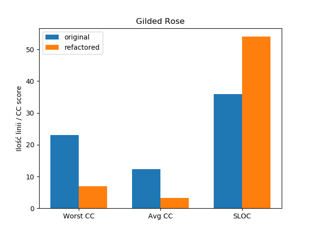

= Refaktoryzacje
:awestruct-layout: base
:showtitle:
:author: Jakub Sikorski

Jakub Sikorski

https://github.com/ksikorski1/GildedRose-refactor[Github]

== Wstęp

Kod "oryginalny" (startowy) Gilded Rose pobrałem z Githuba
Emily Bache (https://github.com/emilybache/GildedRose-Refactoring-Kata[link])

Przedstawię jak krok po kroku refaktoryzowałem Gilded Rose i jak dodałem nowy typ przedmiotów - Conjured. 
Na koniec porównam złożoność wersji oryginalnej i mojej "poprawionej" wersji, używając dwóch metryk: 
złożoności cyklomatycznej i SLOC (source lines of code). Kod jest napisany w Pythonie, a do obliczenia metryk posłużyło
mi narzędzie radon.

Dokument został napisany przy użyciu AsciiDoctor, Eclipse IDE i dostępnego do niego pluginu.

== Refaktoryzacja

=== Krok 0

Wersja napisana przez Leeroya posiada wiele zagnieżdzonych instrukcji warunkowych.
To co chcę uzyskać to "rozbicie" ich na mniejsze komponenty (decompose conditional),
tak aby każdy typ przedmiotu był reprezentowany osobno,
a logika stojąca za zmianami quality każdego z przedmiotów znalazła się w odpowiednich metodach. Podczas pisania metod
były one od razu testowane (plik testy.py w repozytorium), samych testów jednak w tekście nie pokazuję.
Tak wygląda kod wyjściowy, z którego startowałem:

[source,python]
----
class GildedRose(object):

    def __init__(self, items):
        self.items = items

    def update_quality(self):
        for item in self.items:

----

Klasa Item pozostała taka sama jak w oryginalnej wersji, czyli każdy Item posiada name
(nazwę), quality (wartość) oraz sell_in (czyli kiedy powinniśmy sprzedać przedmiot).

=== Krok 1

Pierwszym przedmiotem, który dodałem jest legendarny przedmiot Sulfuras, którego quality jest zawsze 80
i nigdy się nie zmienia.

[source, python]
----
def update_quality(self):
	for item in self.items:
		if "Sulfuras" in item.name:
			self.Sulfuras_QualityCheck(item)
			continue
----
Jeżeli przedmiot to Sulfuras, wywoływana jest metoda sprawdzająca jego quality i po sprawdzeniu pętla 
przechodzi po prostu do następnego przedmiotu.

Metoda Sulfuras_QualityCheck sprawdza czy quality jest na pewno 80 (w razie np. literówki przy
wpisywaniu danych) i wygląda następująco:
[source, python]
----
def Sulfuras_QualityCheck(self, item):
	if item.quality != 80:
		item.quality = 80
----

=== Krok 2

Kolejnym przedmiotem, który dodałem są bilety (Backstage Tickets). Zgodnie ze specyfikacją, 
ich wartość rośnie im bliżej koncertu, gdy jest mniej niż 11 dni do koncertu rośnie o 2,
a gdy mniej niż 6 dni to rośnie o 3. Po koncercie jednak wartość biletu spada do 0.
Update_quality wygląda więc następująco:

[source,python]
----
def update_quality(self):
	for item in self.items:
		if "Sulfuras" in item.name:
			self.Sulfuras_QualityCheck(item)
			continue
        	
		if "Backstage" in item.name:
			self.changeQuality_BackstageTickets(item)
----

Poraz kolejny sprawdzane jest czy przedmiot ma w nazwie "Backstage" i jeśli tak, to wywoływana jest odpowiednia metoda
dla tego przedmiotu.

[source, python]
----
def changeQuality_BackstageTickets(self, item):
	item.quality += 1 # +1
	if item.sell_in < 11 and item.quality < 50:
		item.quality += 1  # +2
	if item.sell_in < 6 and item.quality < 50:
		item.quality += 1  # +3
	if item.sell_in < 0:   # po koncercie
		item.quality = 0
----

=== Krok 3

Następnym przedmiotem, który dodałem jest "Aged Brie", które im starsze, tym wyższa jego wartość.

[source, python]
----
def update_quality(self):
	for item in self.items:
		if "Sulfuras" in item.name:
			self.Sulfuras_QualityCheck(item)
			continue
        	
		if "Backstage" in item.name:
			self.changeQuality_BackstageTickets(item)
			
		if item.name == "Aged Brie":
			self.changeQuality_AgedBrie(item)
----
Tutaj przedmiot ma konkretną, jedną nazwę, więc sprawdzam czy przedmiot się tak nazywa i poraz kolejny wywoływana jest
odpowiednia dla przedmiotu metoda.

[source,python]
----
def changeQuality_AgedBrie(self, item):
	if item.quality < 50:
		item.quality += 1    # +1
		if item.sell_in < 0:
			item.quality += 1   # +2
----

=== Krok 4

Obsługiwane są trzy podstawowe typy przedmiotów: Legendarny Sulfuras, Backstage Tickets oraz Aged Brie.
W żadnym miejscu jednak nie zajmuję się wartością sell_in tych przedmiotów. Napisałem więc metodę,
która "zmienia" dzień na następny, obniżając sell_in przedmiotów o 1.

[source,python]
----
def ChangeDay(self, item):
	item.sell_in -= 1
----

Teraz można ją zastosować w metodzie update_quality:

[source,python]
----
def update_quality(self):
	for item in self.items:
		if "Sulfuras" in item.name:
			self.Sulfuras_QualityCheck(item)
			continue
        	
		if "Backstage" in item.name:
			self.changeQuality_BackstageTickets(item)
			
		if item.name == "Aged Brie":
			self.changeQuality_AgedBrie(item)
		
		self.ChangeDay(item)
----

Teraz dla każdego przedmiotu oprócz Sulfurasa (przez continue) obniżana jest wartość sell_in o 1.

=== Krok 5

Obsługiwane są trzy podstawowe typy przedmiotów. Nie ma jednak obsługi przedmiotów, które nie należą do żadnej z tych
kategorii, czyli "normalnych". Dodałem więc flagę, mówiącą czy przedmiot jest "normalny", której domyślnie wartość jest
true (czyli każdy przedmiot na początku jest normalny) i która zmieni się na false, jeżeli przedmiot należy do jednej
z trzech napisanych typów przedmiotów. Jeśli flaga jednak się nie zmieni, to dla przedmiotu wywoływana jest
metoda dla zwykłych przedmiotów.

[source,python]
----
def update_quality(self):
	for item in self.items:
		normalItem = True
		
		if "Sulfuras" in item.name:
			self.Sulfuras_QualityCheck(item)
			continue
        	
		if "Backstage" in item.name:
			normalItem = False
			self.changeQuality_BackstageTickets(item)
			
		if item.name == "Aged Brie":
			normalItem = False
			self.changeQuality_AgedBrie(item)
			
		if normalItem:     
			self.changeQuality_normalItem(item)
		
		self.ChangeDay(item)
		
----

Dla zwykłych przedmiotów quality się zmniejsza o 1 każdego dnia, a gdy sell_in będzie mniejsze niż 0,
to zmniejsza się o 2.

[source,python]
----
def changeQuality_normalItem(self, item):
	item.quality -= 1          # -1
	if item.sell_in < 0:
		item.quality -= 1  # -2
----

=== Krok 6

Jest obsługa przedmiotów zwykłych, Sulfurasa, Backstage Tickets i Aged Brie. Metody jednak napisane dla tych przedmiotów
dopuszczają możliwość wykroczenia poza wyznaczone wartości, czyli 0 i 50. Napisałem więc metodę, która na koniec
dnia sprawdza czy wartość przedmiotu jest w dozwolonych normach.

[source,python]
----
def QualityCheck(self, item):
	if item.quality > 50:
		item.quality = 50
	if item.quality < 0:
		item.quality = 0
----

I użycie jej, na sam koniec, tak jak wcześniej użyta została metoda ChangeDay. Pełen kod wygląda teraz więc następująco:

[source,python]
----
class GildedRose(object):

    def __init__(self, items):
        self.items = items

    def ChangeDay(self, item):
        item.sell_in -= 1
    
    def changeQuality_AgedBrie(self, item):
        if item.quality < 50:
            item.quality += 1
            if item.sell_in < 0:
              item.quality += 1

    def changeQuality_BackstageTickets(self, item):
        item.quality += 1
        if item.sell_in < 11 and item.quality < 50:
                item.quality += 1
        if item.sell_in < 6 and item.quality < 50:
                item.quality += 1
        if item.sell_in < 0:
            item.quality = 0
        
    def changeQuality_normalItem(self, item):
        item.quality -= 1
        if item.sell_in < 0:
            item.quality -= 1

    def Sulfuras_QualityCheck(self, item):
        if item.quality != 80:
            item.quality = 80

    def QualityCheck(self, item):
        if item.quality > 50:
            item.quality = 50
        if item.quality < 0:
            item.quality = 0
            
    def update_quality(self):
        for item in self.items:
            normalItem = True
            
            if "Sulfuras" in item.name:
                self.Sulfuras_QualityCheck(item)
                continue

            if item.name == "Aged Brie":
                normalItem = False
                self.changeQuality_AgedBrie(item)
                    
            if "Backstage" in item.name:
                normalItem = False
                self.changeQuality_BackstageTickets(item)
            
            if normalItem:
                self.changeQuality_normalItem(item)

            self.ChangeDay(item)

            self.QualityCheck(item)
----

=== Krok 7

Pełen kod, przedstawiony w Kroku 6, jest kodem mającym tą samą funkcjonalność co kod stworzony przez Leeroya.
Została do zrobienia ostatnia rzecz, czyli dopisanie obsługi nowego typu przedmiotów - Conjured. Dodanie obsługi nowego
przedmiotu jest proste. Napisałem metodę odpowiednio zmieniająca quality dla przedmiotów conjured, a do update_quality
dopisałem obsługę tego typu przedmiotów.
[source,python]
----
def changeQuality_Conjured(self, item):
	if item.quality > 0:
		item.quality -= 2       # -2
	if item.sell_in < 0 and item.quality > 0:
		item.quality -= 2     # -4
            
def update_quality(self):
	for item in self.items:
		normalItem = True
            
		if "Sulfuras" in item.name:
			self.Sulfuras_QualityCheck(item)
			continue

		if item.name == "Aged Brie":
			normalItem = False
			self.changeQuality_AgedBrie(item)

		if "Backstage" in item.name:
			normalItem = False
			self.changeQuality_BackstageTickets(item)

		if "Conjured" in item.name:
			normalItem = False
			self.changeQuality_Conjured(item)
            
		if normalItem:
			self.changeQuality_normalItem(item)

		self.ChangeDay(item)

		self.QualityCheck(item)
----

== Złożoność

Mając już gotowy kod nadeszłą pora porównać ze sobą w jakiś sposób to, co ja napisałem, z oryginalnym kodem Leeroya.
W tym celu użyłem narzędzia Radon (https://radon.readthedocs.io/en/latest/[link do dokumentacji]) i skorzystałem z dwóch
metryk, które można obliczyć używając go.

Pierwszą metryką jest SLOC, czyli Source Lines of Code, czyli po prostu ilość linii kodu.
Drugą metryką jest Cyclomatic Complexity, czyli złożoność cyklomatyczna.
Radon na podstawie uzyskanego wyniku (CC score) przyznaje rangi, które mowią o złożoności. Jaki wynik daje jaką rangę
przedstawione jest w tabeli poniżej:

<<<
.Rangi na podstawie wyniku
[%autowidth, cols="^,^,^", halign=center, options="header"]
|===
|*CC score*
|*rank*
|*risk*

|1 - 5
|A
|low - simple block

|6 - 10
|B
|low - well structured and stable block

|11 - 20
|C
|moderate - slightly complex block

|21 - 30
|D
|more than moderate - more complex block

|31 - 40
|E
|high - complex block, alarming

|41+
|F
|very high - error-prone, unstable block

|===

Metryki liczone były jedynie w oparciu o klasę Gilded Rose i wszystkie metody w niej zawarte.
Porównanie dwóch wersji Gilded Rose przy użyciu metryk zamieszczone jest w tabeli poniżej:

.Wyniki
[%autowidth, cols="^,^,^", options="header"]
|===
| 
|*original*
|*refactored*

|Worst CC
|23
|7

|Avg CC
|12.3
|3.3

|SLOC
|36
|54

|===

Avg CC oznacza średnią złożoność cyklomatyczną całego bloku kodu (klasa + metody),
a Worst CC oznacza "najgorszy" (najwyższy) uzyskany wynik w bloku.
To samo porównanie można zrobić używając wykresu słupkowego:

[#img]
.Porównanie wersji zrefaktoryzowanej z wersją oryginalną

Zgodnie z tabelą 1, ranga uzyskana przez moją wersję (na podstawie średniej) to A (score 3.3). Oznacza to, że jest
to kod prosty, o nieznacznym ryzyku. Wersja oryginalna uzyskała rangę C (score 12.3), więc jest to kod nieco skomplikowany,
o umiarkowanym ryzyku. Udało mi się więc uprościć wersję Leeroya.

Patrząc jednak na wynik uzyskany przez najbardziej skomplikowany blok, w obu wersjach tym "blokiem" była metoda
update_quality, to wynik uzyskany w przerobionym Gilded Rose wyniósł 7 (czyli kod bezpieczny), a w oryginalnym
metoda ta uzyskała wynik 23, co oznacza już kod w miarę niebezpieczny i złożony.

Z wyniku SLOC okazuje się, że moja implementacja była dłuższa niż oryginalna. Wynika z tego, że niekoniecznie
kod krótszy jest kodem mniej złożonym.

== Podsumowanie

Z obliczonych wartości złożoności cyklomatycznej wynika, że Gilded Rose przeze mnie zrefaktoryzowane
jest mniej złożone niż wersja oryginalna. Ilość linii kodu tego jednak nie oddaje, więc niekoniecznie jest
to dobry sposób oceniania złożoności kodu.

